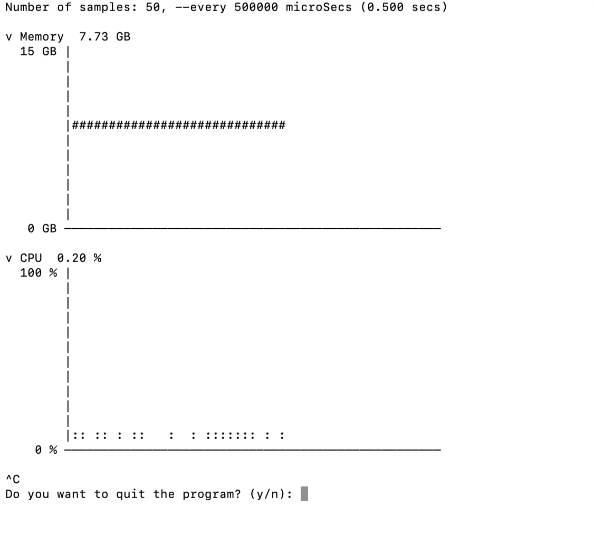
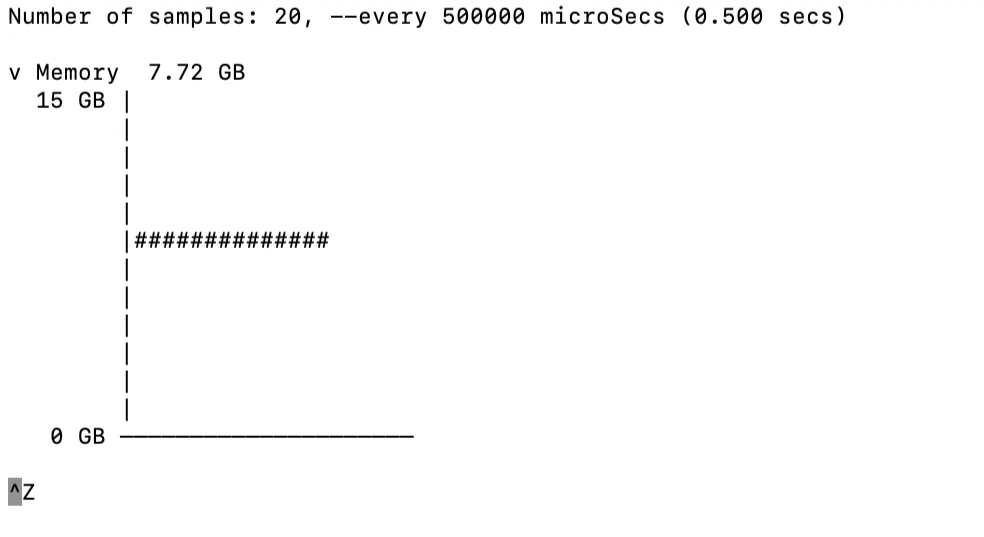
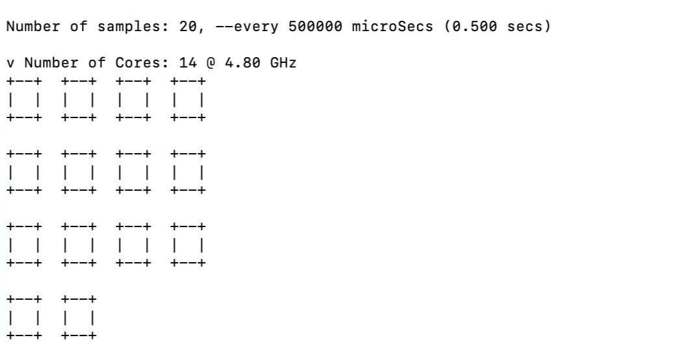
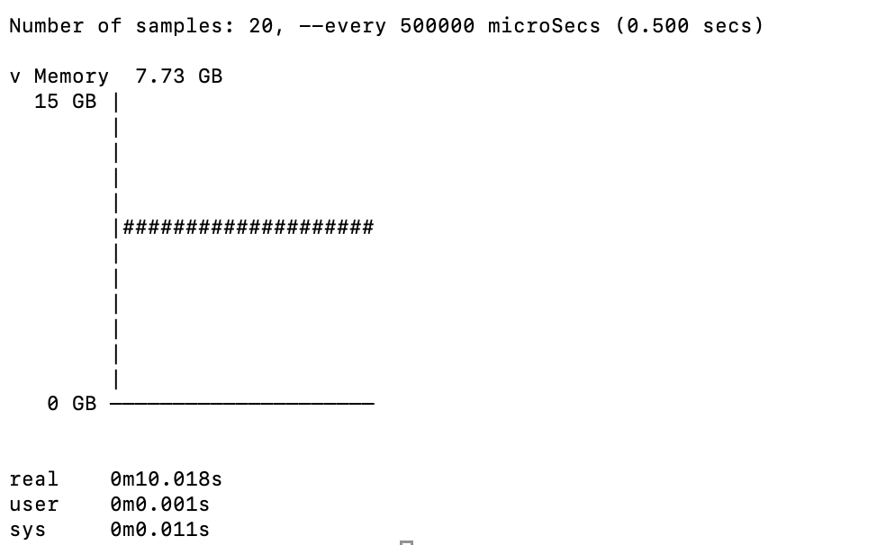

# README

# 1. Meta Data

Author: Jieying Gong

Date: April. 7, 2025

---

# 2. Introduction

This project implements a modular and concurrent system monitoring tool that reports **real-time system utilization metrics** on Linux-based systems. It displays live graphical charts of **memory usage**, **CPU utilization**, and **core configuration (count and frequency)** directly in the terminal using ASCII-based visualization. The tool collects and renders this information periodically, based on user-specified sampling parameters.

The program is designed to accept flexible command-line arguments, supporting both **flagged** (e.g., `--memory, --cpu, --cores, --samples=N, --tdelay=T`) and **positional** arguments (`samples, tdelay`). Default values are applied if unspecified. The display order is fixed as **Memory**, then **CPU**, and finally **Cores**, regardless of the input order.

The tool launches one **dedicated child process per monitoring function for memory utilization, CPU utilization, cores count and cores maximum frequency**, using **pipes for inter-process communication**. These child processes operate concurrently, each independently fetches information and returning results to the parent process for rendering.

Furthermore, the program handles **system signals**:

- **SIGTSTP (Ctrl+Z)** is ignored to prevent background suspension during interactive use.
- **SIGINT (Ctrl+C)** is intercepted and prompts the user for confirmation before exiting.

 All system resource accesses and memory allocations are error-checked to ensure handling of unexpected conditions. 

The program should accept several command line arguments: (from assignment 1 description)

- `-memory` to indicate that only the memory usage should be generated
- `-cpu` to indicate that only the CPU usage should be generated
- `-cores` to indicate that only the cores information should be generated
- `-samples=*N*` if used the value *N* will indicate how many times the statistics are going to be collected and results will be average and reported based on the N number of repetitions.**If not value is indicated the default value will be 20.**
- `-tdelay=*T*` to indicate how frequently to sample in micro-seconds (1 microsec = 10 -6 sec.)**If not value is indicated the default value will be 0.5 sec = 500 milisec = 500000 microsec.**

These last two arguments can also be specified as *positional arguments* if not flag is indicated, in the corresponding order: `*samples tdelay*`.

In this case, these argument should be the **first ones** to be passed to the program.

---

# 3. How to solve the problem:

There are four modules from Assignment 1 (A1), including `memory.h`, `cpu.h`, `core.h`, and `CLA.h`. The first three are used to fetch corresponding system information and print charts, while the CLA module is used to process command-line arguments. All the problems in the A1 have been fixed. And these modules and data structures from a1 are almost completely reused.

Assignment 3 (A3) extends four new modules for concurrency and signal handling:  `sysinfoProducer.h`, `sysinfoConsumer.h`, `pipeTool.h`, and `signalHandler.h`. The design ideas are described below.

---

**Main Architecture for Processes:**

First, we consider that the four different processes needed for information retrieval can be divided into two distinct groups: one related to core information, and the other related to utilization (CPU and memory).

Naturally, this leads to the idea of designing two parent processes, where one parent process is connected to CPU and memory, and the other to core max frequency and core count.

These two parent processes then pass information to the main process. They serve as coordinator processes linking the layers above and below.

That is, the main process forks these two different child processes, which read the data passed to them and print the results. What I have in mind is a three-layer structure:

- At the bottom layer, four processes (grandchildren) serve as writers, fetching the required information and passing it to the next layer via pipe.
- At the second layer, the two child processes serve as coordinators. They read from the grandchildren processes via pipes, encapsulate and combine the information, and then write it via pipe to the main parent process. We use a struct to encapsulate the information.
- At the top layer, the main parent process reads the data from the two child processes and prints it out.

---

**Synchronization of CPU and Memory Transmission:**

For the transmission of CPU and memory data, we use pipes. The bottom-level information-fetching processes use `tdelay` and a loop to continuously fetch data. After each piece of data is obtained, it is passed via pipe to the upper-layer coordinator process, which then combines and passes it to main.

The key to maintaining synchronization between memory and CPU lies in the use of the pipe’s buffer size and the encapsulation of the `UtilizInfo` struct:

- First, the two information-fetching processes share a unified for loop length, determined by the total `samples` value in the `CLAInfo`.
- They have the same number of iterations, meaning they will collect the same number of `samples` and use the same `tdelay`.
- For each sample, one pair of memory and CPU data is read respectively by the coordinator process, combined into a `UtilizInfo` struct, and then this struct is written into the pipe to the main process.
- The pipes from the fetching processes to the coordinator processes are fixed such that each write carries exactly one sample’s worth of data.

So the coordinator will only read the current sample, encapsulate and pass it on before it reads the next sample.

- The pipe to the main process is also fixed to carry exactly the size of one `UtilizInfo` struct.

This ensures synchronized data fetching and transmission.

---

**Producer - Comsumer Modules:**

All coordinators and related writers and readers for information-fetching are encapsulated in the `sysinfoProducer.h` module.

Then the `sysinfoConsumer.h` module is used to let the main process read and print the data.

---

**Pipe FD Handling:**

When forking the two child processes, the corresponding pipe file descriptors are opened and closed in a unified manner.

Each file descriptor is initialized to -1, and unused or already closed file descriptors are also marked as -1.

We use the `safe_close()` function to close file descriptors safely, in order to avoid closing the same fd more than once.

This also avoids the need for numerous if conditions to check whether a file descriptor will be used before closing it.

This effectively reduces coupling and code repetition.

The `safe_close` function is located in the pipeTool.h module, which also contains a collection of reusable utility functions.

---

**Signal Handling:**

For signal handling, a dedicated module named signalHandler is implemented. It mainly handles SIGINT (Ctrl+C).

SIGTSTP (Ctrl+Z) is directly set to SIG_IGN using sigaction, meaning it is ignored.

This module contains a module-wide static global variable sigint_received to track whether a signal has been received.

When the signal handler receives the signal, it will directly set this flag to 1.

In the main loop of the main process (inside `parent_utilization_reader_printer` in `sysinfoConsumer`), I use the `prompt_for_int_signal()` function to poll and check whether the signal was received at the top of every loop iteration, including during data reading and chart printing.

Since I used the blocking `read()` function, when it is blocked and receives SIGINT, it returns -1.

I then check whether the `read(`) failure was caused by signal interruption using `check_sigint()`.

If the failure was caused by signal interruption, I treat it as a special case, not as an error, and return to the top of the loop for signal processing.

The child reader processes for memory and CPU will also receive signal interruptions. I also handle `read()` failures caused by signals in those processes.

This ensures that after receiving a SIGINT, if the user decides to continue the program, it will not be affected by the previously received signal.

---

**Orphan and Zombie Process Prevention:**

To prevent the creation of orphaned or zombie processes, the main process sets each coordinator (second-layer child process) as the leader of a new process group using `setpgid()` right after forking. As a result, all corresponding data-fetching writer processes (grandchildren) inherit the same process group ID (PGID) as their respective parent coordinator.

When the main process encounters a fatal error or the user chooses to exit the program (e.g., by pressing Ctrl+C), it calls `kill()` with a negative PID value to target the entire process group. This ensures that not only the coordinator process but all its child processes (writers) are terminated as a group.

By managing process groups this way, the program avoids cases where the main process exits early and leaves behind running child or grandchild processes, which would otherwise become orphaned and continue executing in the background. 

---

# 4. Implementation

## 4.i Implementation Overview

This system monitoring tool extends the work developed in Assignment 1, where separate modules (`memory`, `cpu`, `core`, and `CLA`) were implemented to retrieve and visualize specific system metrics. These modules are reused without major changes.

Assignment 3 introduces four new modules—`sysInfoProducer`, `sysInfoConsumer`, `pipeTool`, and `signalHandler`—to support **concurrency**, **inter-process communication by pipe**, and **signal handling**.

The program adopts a **producer-consumer model** within a structured **multi-process hierarchy implemented by pipe**. Each information stream (memory, CPU, cores) is managed by a pipeline of  processes, as follows:

- **Bottom layer (data producers):**
    
    Four child processes independently fetch system data:
    
    - Memory usage
    - CPU usage
    - Core count
    - Core maximum frequency
    Each process retrieves system information  and writes it to a pipe.
- **Coordinator roles (within the producer module):**
    
    The `sysInfoProducer` module not only launches the data-fetching processes, but also contains **two coordinator processes**. These intermediate processes serve as **consumers** of raw system data and **producers** of structured output:
    
    - One coordinator receives and combines memory and CPU data into a `UtilizInfo` struct.
    - The other handles core receives and combines count and frequency  information into a `coreInfo` struct.
    These are then passed to the main process through pipes.
- **Top layer (final consumer):**
    
    The main process acts as the final **consumer**. It:
    
    - Parses command-line arguments
    - Forks the coordinator processes
    - Receives their output via pipes
    - Renders real-time charts for memory, CPU, and core usage

The use of this layered producer-consumer structure allows for **concurrency**,  modular separation, and minimal blocking between tasks.

The tool also supports user interaction through **signal handling**. Pressing **Ctrl+C (SIGINT)** triggers an in-program prompt asking the user whether to terminate. **Ctrl+Z (SIGTSTP)** is ignored to prevent background suspension. Signal states are handled safely across all related processes.

---

## 4.ii&iii Modules, Structures, and Functions

The system is divided into **eight modules**, which can be logically grouped into **three functional categories**, each responsible for a distinct layer of functionality as follows:

### 1. System Data Modules

**Modules:**

- cpu.c / cpu.h
- memory.c / memory.h
- core.c / core.h

**Purpose:**

These modules are responsible for low-level system information retrieval and visualization. They access kernel interfaces such as /proc/stat, and the `sysinfo()` system call to collect data about CPU usage, memory usage, and core information. Each module provides data structures and rendering functions  to display real-time charts.

---

**CPU Module (`cpu.c / cpu.h`)**

This module is responsible for retrieving CPU usage statistics and computing real-time CPU utilization percentages.

```c
typedef struct {
    int total_time;
    int idle_time;
} cpuInfo;

typedef struct {
    cpuInfo* before;
    cpuInfo* after;
} cpuDelta;

cpuInfo* get_cpuInfo();
void update_delta(cpuDelta* delta, cpuInfo* new_info);
float calcu_cpu_utiliz(cpuDelta* delta);
void draw_cpu_chart(float *samples, int sample_count, int total);
void free_cpu_delta(cpuDelta* delta);
```

- `get_cpuInfo()` reads the first line of /proc/stat to extract total and idle time ticks.
- `update_delta()`stores a previous and current snapshot of CPU time.
- `calcu_cpu_utiliz()` calculates the percentage of CPU activity over time.
    - (CPU utilization calculation way from  assignment description )
    - total cpu utilization time: $*T_i = user_i + nice_i + sys_i + idle_i + IOwait_i + irq_i + softirq_i*$
    - idle time: $*I_i = idle_i*$ where  represents a sampling time; hence the CPU utilization at time  is given by $U_i = T_i - I_i$
    - Then, the CPU utilization will be given by, $\frac{U_2 - U_1}{T_2 - T_1} * 100$
- `draw_cpu_chart()` renders the CPU utilization trend in a terminal-based vertical chart.
- All calculations use raw CPU times and standard file I/O with error checking.

---

**Memory Module (** `memory.c / memory.h`)

This module gathers memory statistics and displays real-time usage in GB.

```c
typedef struct {
    unsigned long total_memory_kb;
    unsigned long free_memory_kb;
} OriginMemInfo;

typedef struct {
    float total_memory;
    float used_memory;
} MemoryInfo;

void fetch_memory_info(OriginMemInfo* info);
OriginMemInfo* get_originMem_info();
MemoryInfo* calcu_MemoryInfo_GB(OriginMemInfo* origin);
MemoryInfo* get_MemoryInfo();
void draw_memory_chart(float *samples, int sample_count, int total, float total_memory);
```

- `fetch_memory_info()` calls `sysinfo()` to get system memory values.
- `calcu_MemoryInfo_GB()` converts memory from KB to GB and computes used memory.
    - Memory usage = total_memory - free_memory
- `get_MemoryInfo()` returns a processed snapshot in GB format.
- `draw_memory_chart()` plots memory usage over time using # symbols and terminal positioning.

---

**Core Module (`core.c / core.h`)**

This module detects the number of CPU cores and their maximum frequency, and visualizes core layout.

```c
typedef struct {
    int cores_num;
    float max_freq;
} coreInfo;

int get_cores_num();
float get_max_freq();
coreInfo* get_coreinfo();
coreInfo* combine_coreinfo(int core_num, float max_freq);
void draw_all_core(coreInfo* info);
```

- `get_cores_num()` reads /proc/cpuinfo to determine the number of physical cores.
- `get_max_freq()` reads from /sys/.../cpuinfo_max_freq to obtain max frequency in GHz.
- `get_coreinfo()` returns both values as a struct.
- `draw_all_core()` displays core blocks in rows of four using ASCII symbols.

---

### 2. Concurrent Execution Modules

**Modules:**

- sysInfoProducer.c / sysInfoProducer.h
- sysInfoConsumer.c / sysInfoConsumer.h

**Purpose:**

These modules implement the  **producer-consumer model** using multiple processes and pipes.

- sysInfoProducer creates all system data collector processes (for CPU, memory, and cores) and acts as a coordinator to aggregate results.
- sysInfoConsumer resides in the main process and reads aggregated data through pipes, rendering real-time output using the data modules.

This design  is used for concurrency,  inter-process communication by pipe and decoupling.

---

**System Info Producer Module (`sysInfoProducer.c / sysInfoProducer.h`)**

This module launches all low-level processes that **fetch system information concurrently** and pass it upward using pipes. It contains both the bottom-layer *writer processes* and the *coordinator roles* that aggregate data for the main process.

```c
typedef struct utiization_info {
    float cpu_utiliz;
    MemoryInfo mem_utiliz;
} UtilizInfo;

void fetch_utilization_with_pipe(CLAInfo* cla_info, int write_to_parent_fd);
void fetch_core_info_with_pipe(int write_fd_to_parent);
```

- `fetch_utilization_with_pipe()` forks two writer processes: one for memory and one for CPU.
    - These writers each fetch samples of data at fixed tdelay intervals.
    - A coordinator process reads both streams, combines them into a UtilizInfo struct, and writes to the main process.
- `fetch_core_info_with_pipe()` forks two child processes:
    - One fetches the number of cores, the other fetches max frequency.
    - Their results are combined into a coreInfo struct and passed to the main process.
- All communication is done through pipes with proper `safe_close()` and error checking.
- These processes form the “producer” side of the producer-consumer model.

---

**System Info Consumer Module (`sysInfoConsumer.c / sysInfoConsumer.h`)**

This module defines the reading and visualization logic on the main process side. It acts as the consumer that receives aggregated data and renders results.

```c
int parent_utilization_reader_printer(int utiliz_read_fd, UtilizInfo* info, CLAInfo* cla);
int parent_core_info_reader_printer(int core_read_fd, coreInfo* info);
```

- `parent_utilization_reader_printer()` reads UtilizInfo structs from a pipe and prints memory and CPU usage graphs in real-time.
    - It stores usage samples and updates the chart at each iteration.
    - It also handles SIGINT by calling `prompt_for_int_signal()` to allow user confirmation on exit.
- `parent_core_info_reader_printer(`) reads one coreInfo struct and calls `draw_all_core()` to visualize the core layout.

---

### 3. Control & Support Modules

**Modules:**

- pipeTool.c / pipeTool.h
- signalHandler.c / signalHandler.h
- CLA.c / CLA.h

**Purpose:**

These modules support the **r**untime control, user interaction, and safe operation of the system:

- CLA parses command-line arguments (including flags and positional arguments).
- pipeTool provides safe pipe/file descriptor management and process cleanup utilities.
- signalHandler intercepts signals like SIGINT (Ctrl+C) and SIGTSTP (Ctrl+Z), and provides user prompts for graceful interruption handling.

Together, they ensure that the program remains robust, interactive, and  user interface, and runtime security control.

---

**Pipe Tool Module (`pipeTool.c / pipeTool.h`)**

This utility module provides reusable helpers for pipe handling, process management, and resource cleanup.

```c
int wait_for_children(pid_t children);
void safe_close(int* fd);
void exit_failure_with_two_pipe_close(int* fd1, int* fd2);
void kill_all_children(pid_t child1, pid_t child2);
```

- `safe_close()` safely closes a file descriptor and sets its value to -1, preventing double-close errors.
- `exit_failure_with_two_pipe_close()` is used when two pipes need to be closed and the program should exit immediately due to an error.
- `wait_for_children()` waits for a child process to finish and checks whether it exited normally; if not, it returns -1.
- `kill_all_children()` is used to terminate both child process groups using SIGTERM, ensuring cleanup when exiting abnormally or upon errors.

These helpers improve code safety and reduce redundancy across modules using pipes and forks.

---

**Signal Handler Module (`signalHandler.c / signalHandler.h`)**

This module handles system signals, mainly **SIGINT (Ctrl+C)** and **SIGTSTP (Ctrl+Z)**, ensuring the program behaves safely and interactively under interruption.

```c
int check_sigint();
void init_sigaction();
int prompt_for_int_signal();
```

- `init_sigaction()` sets up a custom signal handler for SIGINT, and ignores SIGTSTP.
- `check_sigint()` returns whether SIGINT has been received (based on an internal flag).
- `prompt_for_int_signal()` is called inside loops; if a signal is detected, it prompts the user whether to quit or continue, and clears the terminal lines accordingly.

Signal state is tracked using a `volatile sig_atomic_t` flag in the module.

---

**CLA Module (`CLA.c / CLA.h`)**

This module processes **command-line arguments** passed to the program, supporting both flagged and positional forms.

```c
typedef struct {
    int graph_flag[3];  // [0]: memory, [1]: CPU, [2]: cores
    int samples;
    int tdelay;
} CLAInfo;

void read_CLA(int argc, char** argv, CLAInfo* info);
```

- `read_CLA()` sets default values for samples and tdelay, and then parses arguments.
    - It fills the CLAInfo struct with user preferences and activates the corresponding flags.
    - If no display flags are provided, it enables all three metrics by default.

This module ensures flexible and user-friendly control over the tool’s runtime behavior.

---

# 5. Flow Chart


---

# 6. Instructions on How to Compile the Code

### Requirements:

- Run on Linux OS
- GCC compiler installed

### Compilation Steps:

1. **Navigate to the project directory**
2. **Compile the Program using make command:**
    
    Run the following command to compile the program using the provided Makefile:
    
    ```bash
    make
    ```
    
    It will:
    
    - Compile each source file (`myMonitoringTool.c`, `sysInfoProducer.c`, `sysInfoConsumer.c` , `CLA.c` , `cpu.c`, `core.c`, `memory.c`, `pipeTool.c` and `signalHandler.c`) into object files (`.o` files).
    - Link all object files into the target executable named `myMonitoringTool`.
    
    **Compilation Flags Explained:**
    
    ```c
     -Wall -Wextra -std=c99 -lm
    
    ```
    
3. **Run the Executable:**
    
    After successful compilation, execute the program for default action using:
    
    ```bash
    ./myMonitoringTool
    ```
    
    And it can be executed with multiple command line arguments:
    
    ```c
    ./myMonitoringTool [samples [tdelay]] [--memory] [--cpu] [--cores] [--samples=N] [--tdelay=T]
    
    ```
    

---

### Makefile Rules Explained:

- **Default Rule (`make`)**:
    - Compiles and links the object files into the final executable (`myMonitoringTool`).
- **Clean Rule (`make clean`)**:
    - Removes generated object files (`.o`) and the executable (`myMonitoringTool`).
    - Use this command to clean up:
    
    ```bash
        make clean
    ```
    

---

# 7. Expected Results

### Default Case

```bash
./myMonitoringTool 

// The default case is same as below:
./myMonitoringTool 20 500000 --memory --cpu --cores
```


---

### Expected Result with some flags

Notice the order of command line arguments  won’t influence the the order of output displayed.

**CASE 1:**

```bash
./myMonitoringTool 50 100000 --cpu --cores --memory
```


**CASE 2:**

```bash
./myMonitoringTool --cores --cpu --samples=30 --tdelay=200000
```


---

### Ctrl+C (SIGINT) Handling

The program will ask the user whether it wants to quit or not the program and proceed according to the user response. If user entered “y”, the program will exit. The output of the display will stop while waiting for the user to respond.




### 

---

### Ctrl+Z (SIGSTP) Handling

It will be ignored and won’t influence program’s display.



---

# 8. Test Cases

### Invalid CLA:

The program will print the invalid CLA and if there is no valid CLA, it would show as a default case. And if there is valid CLA in it, it would display the output the the valid CLA.

**CASE 1:**

```c
./myMonitoringTool --a --b 1000
```


**CASE 2:**

```c
./myMonitoringTool --a --cores
```




---

# 9.Disclaimers/Comment

- The program has been tested using **Valgrind**, and all file descriptors are properly closed when the processes exit, ensuring there are **no memory leaks or descriptor leaks.**
- The program has also been manually verified using **htop**, confirming that after receiving Ctrl+C and choosing to exit, **all child and grandchild processes are properly terminated.**
- In the memory and CPU graph display, **data points with a value of 0 will not be plotted on the char**t. This design choice avoids misleading output in the visualization.
- **The height of the terminal should be at least 33 lines**, and preferably more than 40, to properly display the entire output. If a large number of samples are requested, the terminal width must also be sufficient to avoid output overflow or misalignment.
- Regardless of whether the user requests CPU/memory utilization graphs or core information graphs, the main process will always create two separate pipes for each category. However, it only forks the corresponding child processes if needed, and closes the unused pipe ends afterward. Similarly, for CPU and memory utilization, both pipes are created even if only one of them is being used. This may lead to temporary use of file descriptors that are not ultimately used, resulting in a small amount of overhead. However, given the short duration and small scale of waste, this is acceptable.
- During the SIGINT (Ctrl+C) prompt, the background system continues running and data collection continues as well.If the user decides to continue the program, the collected data during the prompt window will be included in the subsequent graph rendering.

---

### Time Restriction:

For typical configurations, such as samples = 20 and tdelay = 0.5 seconds, the program completes execution within the expected limit of:

$\text{time} = \text{samples} \times \text{tdelay} \times 101\% = 20 \times 0.5\,s \times 1.01 = 10.1\,s$

It does **not exceed the expected duration by more than 1%**, and any slight differences are due to system scheduling and the time consumed in user/kernel space (user and sys time).

```bash
time ./myMonitoringTool
```


```bash
time ./myMonitoringTool --cpu
```


```bash
time ./myMonitoringTool --memory
```



However, when tdelay is set to a very small value(e.g. 0.01s), the program may exceed the expected execution time limit. For example in this case:

```bash
time ./myMonitoringTool 50 10000
```

With the result:

real：	0m0.538s
user：	0m0.009s
sys：	0m0.037s

The actual runtime (real) was 0.538s, which exceeds the target of 0.505s.

This is caused by the relatively higher proportion of sys time under small tdelay settings, where system calls and context switches have a more noticeable overhead.

Therefore, while the time-bound logic holds in general, it may not be guaranteed when tdelay is set to very low values.

---

# 10. Reference

[https://man7.org/linux/man-pages/man2/pipe.2.html](https://man7.org/linux/man-pages/man2/pipe.2.html)

[https://man7.org/linux/man-pages/man2/read.2.html](https://man7.org/linux/man-pages/man2/read.2.html)

[https://man7.org/linux/man-pages/man2/write.2.html](https://man7.org/linux/man-pages/man2/write.2.html)

[https://man7.org/linux/man-pages/man2/close.2.html](https://man7.org/linux/man-pages/man2/close.2.html)

[https://man7.org/linux/man-pages/man3/perror.3.html](https://man7.org/linux/man-pages/man3/perror.3.html)

[https://man7.org/linux/man-pages/man3/fprintf.3p.html](https://man7.org/linux/man-pages/man3/fprintf.3p.html)

[https://valgrind.org/docs/manual/manual.html](https://valgrind.org/docs/manual/manual.html)

[https://man7.org/linux/man-pages/man7/signal-safety.7.html](https://man7.org/linux/man-pages/man7/signal-safety.7.html)

[https://man7.org/linux/man-pages/man7/signal.7.html](https://man7.org/linux/man-pages/man7/signal.7.html)

[https://man7.org/linux/man-pages/man3/usleep.3.html](https://man7.org/linux/man-pages/man3/usleep.3.html)
[https://man7.org/linux/man-pages/man7/ascii.7.html](https://man7.org/linux/man-pages/man7/ascii.7.html)
[https://man7.org/linux/man-pages/man3/exit.3.html](https://man7.org/linux/man-pages/man3/exit.3.html)

[https://man7.org/linux/man-pages/man2/fork.2.html](https://man7.org/linux/man-pages/man2/fork.2.html)

[https://stackoverflow.com/questions/876605/multiple-child-process](https://stackoverflow.com/questions/876605/multiple-child-process)
[https://docs.oracle.com/cd/E19683-01/806-4125/6jd7pe6bo/index.html](https://docs.oracle.com/cd/E19683-01/806-4125/6jd7pe6bo/index.html)
[https://www.reddit.com/r/C_Programming/comments/i28j1p/piping_parent_and_child_processes_linux/](https://www.reddit.com/r/C_Programming/comments/i28j1p/piping_parent_and_child_processes_linux/)
[https://www.geeksforgeeks.org/c-program-demonstrate-fork-and-pipe/](https://www.geeksforgeeks.org/c-program-demonstrate-fork-and-pipe/)

[https://www.man7.org/linux/man-pages/man2/setpgid.2.html](https://www.man7.org/linux/man-pages/man2/setpgid.2.html)
[https://man7.org/linux/man-pages/man1/kill.1.html](https://man7.org/linux/man-pages/man1/kill.1.html)

[https://www.ibm.com/docs/en/zos/2.4.0?topic=functions-setpgid-set-process-group-id-job-control](https://www.ibm.com/docs/en/zos/2.4.0?topic=functions-setpgid-set-process-group-id-job-control)

[https://serverfault.com/questions/866507/killing-process-group-safely](https://serverfault.com/questions/866507/killing-process-group-safely)
[https://www.stackstate.com/blog/sigkill-vs-sigterm-a-developers-guide-to-process-termination/](https://www.stackstate.com/blog/sigkill-vs-sigterm-a-developers-guide-to-process-termination/)
[https://man7.org/linux/man-pages/man2/kill.2.html](https://man7.org/linux/man-pages/man2/kill.2.html)
[https://man7.org/linux/man-pages/man3/errno.3.html](https://man7.org/linux/man-pages/man3/errno.3.html)